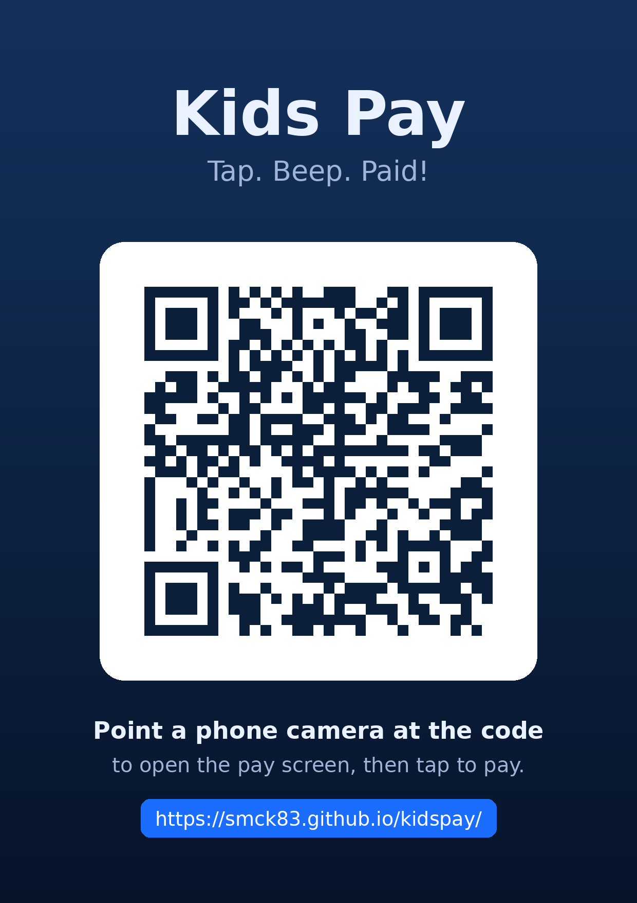

# Kids Pay

A pretend tap-and-pay screen for kids' shop play. It looks like a phone payment
screen: tap anywhere (or press the button), and it beeps, buzzes, and shows a
"Paid!" checkmark with a random amount. Great for toy cash registers and
make-believe shops.

**Live demo:** https://smck83.github.io/kidspay/



## Features

- Tap-to-pay screen styled like a contactless payment app
- Beep (Web Audio) and vibrate (where supported) on every "payment"
- Tap anywhere on the screen, or use the **Tap to Pay** button
- **Web NFC** (Chrome on Android): hold a real NFC tag to the phone to trigger a
  payment. Starts on the first tap, no separate button. Falls back gracefully to
  screen taps everywhere else.
- **Installable PWA**: add to the home screen and it runs full-screen and offline
- **Printable QR poster** (`qr-poster.png`) to stick on a toy register so guests
  can scan and open the pay screen on their own phone

## Quick start

It's a static site. Any of these work:

- Open `index.html` in a browser. The screen tap, beep, and "Paid!" animation
  all work from `file://`. **NFC and PWA install need HTTPS**, so use one of the
  options below to try those.
- Serve the folder locally:

  ```bash
  python3 -m http.server 8000
  # then open http://localhost:8000
  ```

- Host it for free on **GitHub Pages**: push this repo, enable Pages on the
  `main` branch, and your copy is live over HTTPS (so NFC and install work).

## NFC tags

NFC works in **Chrome on Android** only (not iOS, not Samsung Internet). It uses
the [Web NFC API](https://developer.mozilla.org/en-US/docs/Web/API/Web_NFC_API).

- Cheap blank tags (NTAG213/215, a few cents each) are all you need. The app
  treats any tag tap as a payment, even a blank one.
- Web NFC can **read** a tag's ID and any NDEF text/URL written to it. It cannot
  read real bank cards, read card numbers, or make real payments. It's purely for
  play.

## Printable poster

`qr-poster.png` is a ready-to-print poster with a QR code pointing at the demo
site. Print it, stick it on the toy register, and friends or family can scan it
to open the pay screen on their phone. The QR uses high error correction so it
still scans with a bit of wear.

To regenerate the poster and icons (e.g. if you fork to your own URL):

```bash
pip install pillow qrcode
python gen_icons.py     # app icons
python gen_poster.py    # qr-poster.png and qr-code.png (edit URL at top of file)
```

## Files

| File | Purpose |
| --- | --- |
| `index.html` | The whole app (HTML, CSS, JS in one file) |
| `manifest.webmanifest` | PWA manifest |
| `sw.js` | Service worker for offline support |
| `icon-*.png`, `apple-touch-icon.png` | App / home-screen icons |
| `qr-poster.png` | Printable poster with QR to the demo site |
| `qr-code.png` | Plain QR code image |
| `gen_icons.py` | Regenerates the app icons |
| `gen_poster.py` | Regenerates the poster and QR |
| `Dockerfile` | Optional: build a tiny container to self-host |

## Self-hosting with Docker

```bash
docker build -t kidspay .
docker run -p 8080:80 kidspay
# open http://localhost:8080
```

## License

MIT. See [LICENSE](LICENSE).

## Author

[smck83](https://github.com/smck83)
